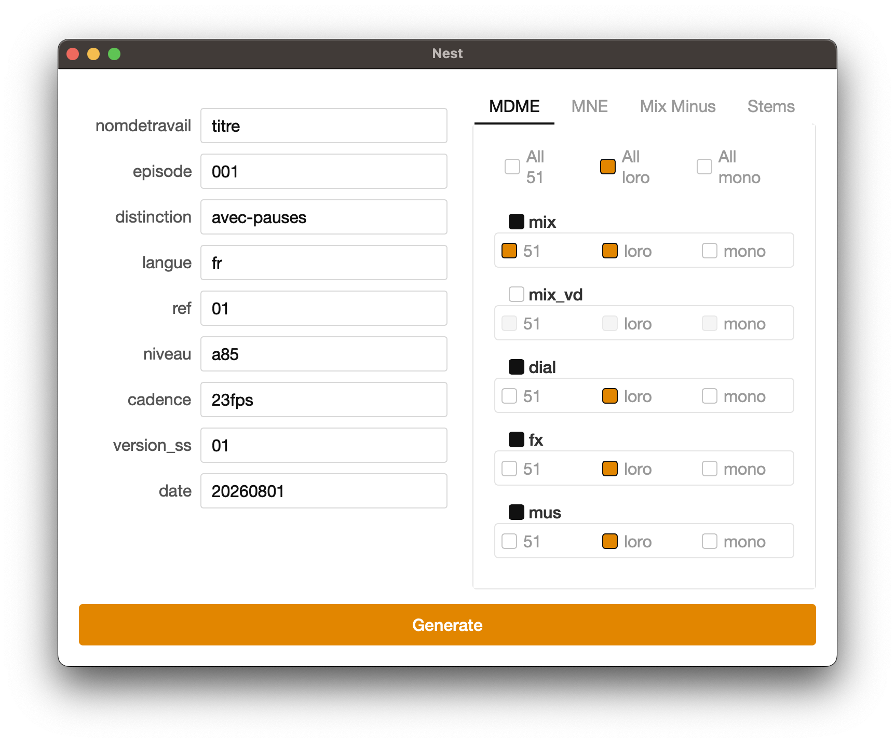

# Nest

A macOS desktop application that generates strictly-formatted delivery folder structures for audio post-production, from a form instead of by hand.

The application is designed in French, as it is intended for use within a French-speaking company. 

Built with PySide6 on top of a pure-Python engine that is fully unit-tested and has zero GUI dependencies.

<!-- Add a screenshot: drop an image in the repo, then update the path below -->


---

## The problem

Audio post-production deliverables follow a rigid naming convention. Every folder name is assembled from the same set of fields, in the same order, with the delivery type and channel configuration varying per item:

```
[nomdetravail]_[episode]_[distinction]_[langue]_ref[ref]_mix_[canaux]_[niveau]_[cadence]_ss[version_ss]_[date]
```

A single delivery can require a dozen of these folders, each differing by only two or three characters. Typing them by hand is slow and one typo propagates silently through the whole delivery.

Nest collects the shared fields once, lets the user tick which delivery items and channel configurations are needed, and writes the full structure to a chosen destination.

---

## Features

**Form**
- One field per token, generated from a data-defined token list
- Today's date pre-filled automatically in `YYYYMMDD`
- Form values persist between sessions via `QSettings`

**Delivery selection**
- 18 delivery items grouped into four tabs by category
- Per-item channel selection (5.1, LoRo, mono)
- "All" master checkboxes that set one channel across an entire tab in a single click
- Unchecking a delivery item automatically disables its channel options

**Generation**
- Native destination picker
- Validation before anything is written: missing fields, missing delivery selection, delivery items with no channel chosen, and characters that are illegal in folder names
- Idempotent folder creation, safe to re-run against the same destination

---

## Architecture

The central design decision is a hard separation between **deciding what to build** and **building it**.

```
   app.py  (PySide6 GUI)
      |
      |  values: dict     selection: dict
      v
   core.py  (pure functions, no Qt, no I/O except one function)
      |
      |  plan_job()  ->  {"parent": str, "children": list[str]}
      v
   create_folders()  ->  disk
```

`core.py` imports nothing except `pathlib`. It knows nothing about Qt, forms, or checkboxes. It receives plain dictionaries and returns plain data structures. That makes the entire naming engine testable without instantiating a single widget.

The engine is four layers, each calling the one below it:

| Function | Responsibility |
|---|---|
| `fill_template` | Substitute `[tokens]` in one pattern. Pure string work. |
| `fill_for_channels` | Produce one folder name per selected channel. |
| `build_all` | Flatten every selected delivery item into one list of children. |
| `plan_job` | Assemble parent name plus children into a job description. |
| `create_folders` | The only function that touches the filesystem. |

---

## Key engineering decisions

**The engine was built and tested before any GUI existed.**
The full token-substitution pipeline was written as plain functions and driven from a command-line script first. The GUI was added afterwards as a second client of the same engine. This meant that when the interface misbehaved, the naming logic was already provably correct and could be ruled out immediately.

**Planning is separated from execution.**
`plan_job` computes the complete folder structure and returns it without touching the disk. `create_folders` takes that result and writes it. This split makes preview, dry-run, and confirmation dialogs possible without restructuring anything, and it means the expensive-to-test half (filesystem I/O) is isolated to one five-line function.

**No globals reach into functions.**
Every function in `core.py` receives what it needs through its parameters. Nothing reads module-level state. That is what allows the same engine to be driven by a script, a test, or a GUI without modification.

**The UI is generated from data, not hand-written.**
Five separate concerns are defined as module-level data and consumed by generic loops:

- `TOKENS` drives which form fields exist
- `DEFAULTS` drives which fields are pre-filled and with what
- `CHANNELS` drives the channel checkboxes
- `CATEGORIES` drives the tab grouping
- `style.qss` drives the entire visual appearance

Adding a form field or a delivery category is a one-line data change. No widget code is edited.

**Presentation structure is kept separate from domain structure.**
`CATALOG` maps a delivery item to its naming pattern. `CATEGORIES` maps a tab name to the items it displays. Merging them into one nested structure would have been tempting, but it would have broken `plan_job`'s flat `catalog[item]` lookup. Keeping them separate means the tab layout can be reorganised without the engine noticing.

**Validation happens at the input boundary.**
All input checking lives in the GUI, before `plan_job` is called. Values are stripped at read time, so downstream code never handles whitespace. The engine contains no defensive checks because nothing malformed can reach it.

**Resource paths are resolved, never assumed.**
The stylesheet is located relative to the module, and the lookup is aware of whether the app is running as a script or from a frozen PyInstaller bundle:

```python
def resource_path(filename: str) -> Path:
    base = Path(getattr(sys, "_MEIPASS", Path(__file__).parent))
    return base / filename
```

The same principle applies throughout: the destination directory is passed in as a parameter rather than hardcoded, and no code assumes the current working directory.

---

## Naming grammar

**Shared tokens** (entered once in the form, applied to every folder):

`nomdetravail`, `episode`, `distinction`, `langue`, `ref`, `niveau`, `cadence`, `version_ss`, `date`

**Per-item token**: `canaux`, supplied once per selected channel. Two channels selected on one delivery item produce two folders.

Fixed prefixes such as `ref` and `ss` live inside the patterns rather than in the code, so the user types only the varying part and the naming convention stays with the template.

Not every pattern uses every token. `fill_template` iterates over the supplied values rather than over the pattern, so a token absent from a pattern is simply never substituted. This is why `niveau` can apply to mix deliveries and not to stems with no conditional logic anywhere.

---

## Tech stack

| Layer | Tools |
|---|---|
| **Language** | Python 3.12+ (type hints throughout `core.py`) |
| **GUI** | PySide6 (Qt for Python) |
| **Styling** | Qt Style Sheets, loaded from an external `.qss` file |
| **Persistence** | `QSettings` (platform-native preferences storage) |
| **Filesystem** | `pathlib` |
| **Testing** | pytest |
| **Packaging** | PyInstaller (standalone `.app` bundle) |

---

## Project structure

```
nest/
├── app.py            # GUI: window, dialog, form, tabs, validation
├── core.py           # naming engine: pure functions, no Qt
├── style.qss         # external stylesheet
├── test_core.py      # pytest suite for the engine
├── requirements.txt  # runtime dependencies
└── README.md
```

---

## Running from source

**1. Clone the repo**

```bash
git clone https://github.com/AntoinePigeon/nest-folder-app.git
cd nest
```

**2. Create and activate a virtual environment**

```bash
python3 -m venv venv
source venv/bin/activate        # Windows: venv\Scripts\activate
```

**3. Install dependencies**

```bash
pip install -r requirements.txt
```

**4. Run**

```bash
python app.py
```

---

## Testing

```bash
pytest -v
```

The suite covers the naming engine: token substitution, the one-folder-per-channel contract, flattening across multiple delivery items, and the shape of the job returned by `plan_job`. One test deliberately documents the current behaviour when a token has no supplied value, so that an implicit behaviour is recorded rather than assumed.

Because the engine is pure, none of these tests create a folder, mock a filesystem, or start a Qt event loop.

---

## Building the macOS app

```bash
pip install pyinstaller
pyinstaller --windowed --name Nest --icon Nest.icns --add-data "style.qss:." app.py
```

The bundle appears in `dist/`. The `--add-data` flag is what includes the stylesheet, and `resource_path()` is what allows the same code to find it in both development and frozen builds.

---

## Installing on another Mac

The app is not code-signed, so macOS Gatekeeper will block it on first launch.

1. Move `Nest.app` to `/Applications` (running it from `Downloads` triggers App Translocation).
2. Open it. Dismiss the warning with **Done**.
3. Go to **System Settings → Privacy & Security**, scroll to the **Security** section, and click **Open Anyway**.
4. Authenticate, then launch the app again.

This is only required once. Note that the Control-click override used by older macOS versions no longer works for unsigned apps.

---

## Iterations worth documenting

**A registry that was silently a set, not a dict.**
The nested widget registry was written as `registry[item] = {group, checkbox}`. Without colons, that is set syntax, not dict syntax. It raised no error, because widgets are hashable, and the UI rendered perfectly. The bug only surfaced when the code tried to look up a widget by name. The fix was trivial; the lesson was that structure should be verified with `len()` and `type()` rather than by looking at the screen, since the screen looks identical in both the correct and incorrect versions.

**Type hints exposing a contradiction between two functions.**
Adding annotations to `core.py` revealed that `build_all` declared `selection` as `dict[str, str]` while `fill_for_channels`, which it calls, declared the same data as `list[str]`. The code had always worked, because Python does not enforce annotations, but the documented contract between the two functions was wrong and would have misled any reader. Static typing turned an invisible inconsistency into a visible one.

**A refactor that initialised the window twice.**
When `main()` was converted into a `QWidget` subclass, `build_ui()` ended up being called both from `__init__` and from the call site. The result was two complete sets of widgets: the visible ones from the first build, and the ones referenced by `self.fields` from the second. Nothing crashed, and the window looked correct, but reading the form returned empty values. Qt reported the underlying layout conflict in the terminal, which is a reminder that a GUI application's console output is a diagnostic channel rather than noise.

---

## What I learned

- **Designing an engine before an interface**, and why the seam between them determines how much later changes cost
- **Pure functions and testability**: keeping I/O in one place so the rest can be verified without mocks
- **Event-driven programming**: the Qt event loop, signals and slots, and pre-binding callback arguments with `functools.partial` to avoid late-binding closures
- **Composite layouts**: nesting layouts and widgets into a tree, and diagnosing invisible widgets by tracing the parent chain
- **Data-driven UI construction** and the repeated refactor of turning conditionals into lookup tables
- **Input validation at the boundary**, including guard clauses and normalising data at read time
- **Type hints** as a design tool rather than documentation
- **Desktop packaging**: PyInstaller bundles, resource path resolution in frozen apps, and macOS code-signing constraints

---

## Possible future work

- In-app editor for adding and removing delivery items, which would require the catalog to become writable user data stored outside the read-only app bundle
- Live preview of the folder names before generation, made straightforward by the existing plan/execute split
- A test for `create_folders` using pytest's `tmp_path` fixture
- Consistency check between `CATALOG` and `CATEGORIES` so that an item added to one but not the other is reported rather than silently invisible
- Code signing and notarisation to remove the Gatekeeper step

---

## License

This project is for personal and educational use.
